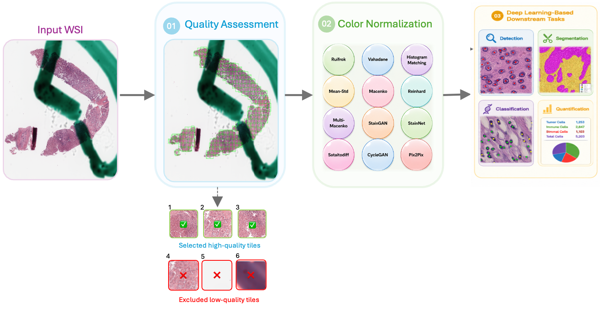

# WSI-QCN


<p align="justify">  The pipeline begins with an input whole-slide image (WSI), followed by a quality assessment (QA) stage that identifies and retains high-quality tissue tiles while excluding low-quality regions affected by artifacts, blur, background, or insufficient tissue content. The selected tiles are then processed using one of 12 color normalization methods, including traditional approaches (Ruifrok, Vahadane, Histogram Matching, Mean-Std, Macenko, Reinhard, and Multi-Macenko) and deep learning-based methods (StainGAN, StainNet, Sastaindiff, CycleGAN, and Pix2Pix), to reduce stain variability and improve color consistency. The resulting normalized images provide standardized inputs for a wide range of deep learning-based computational pathology tasks, such as nuclei detection, segmentation, classification, and quantitative analysis. </p>

This pipeline consists of two sequential steps designed to generate high-quality, standardized H&E image tiles for downstream deep learning applications.

### 1. Quality Assessment (QA)
The quality assessment model is first applied [WSI-SmartTiling](https://github.com/Falah-Jabar-Rahim/Fully-Automatic-Content-Aware-Tiling-Pipeline-for-WSIs) to the whole-slide images (WSIs) to identify and remove low-quality regions (e.g., background, blur, artifacts, or out-of-focus areas). Only high-quality tissue tiles are retained and exported for the next preprocessing stage.

### 2. Color Normalization (ColorNorm)
The retained image tiles are then processed using the color normalization pipeline provided in this repository. This step reduces stain and color variability across H&E images, producing standardized image tiles that can be directly used for downstream tasks such as nuclei detection, segmentation, classification, and quantitative analysis.

# Setting Up the Pipeline:
1. System requirements:
- Ubuntu 20.04 or 22.04
- CUDA version: 12.2
- Python version: 3.9 (using conda environments)
- Anaconda version 23.7.4
2. QA:
  - For WSI quality assessment and tile generation, refer to [WSI-SmartTiling](https://github.com/Falah-Jabar-Rahim/Fully-Automatic-Content-Aware-Tiling-Pipeline-for-WSIs) 

3. ColorNorm:

- Clone the repo
```bash
git clone https://github.com/Falah-Jabar-Rahim/WSI-QCN.git
cd WSI-QCN
```
- Create the conda environment
```bash
conda create -n WSI-QCN python=3.10
conda activate WSI-QCN
pip install -r requirements.txt
```
**Note:** PyTorch version should matches your CUDA driver. Check your CUDA version with `nvidia-smi`, then follow the official installation [guide](https://pytorch.org/get-started/locally/)

4. Verify Installation

- Run the following command to verify that all dependencies have been installed correctly:

```bash
python test_installation.py
```


## Supported methods

| name                 | mode       | framework  | needs a target/reference | needs a checkpoint |
|----------------------|------------|------------|---------------------------|---------------------|
| `ruifrok`            | sequential | numpy      | yes (`target`)             | no |
| `vahadane`           | sequential | numpy      | yes (`target`)             | no |
| `histogram_matching`  | sequential | numpy      | yes (`target`)             | no |
| `mean_std`           | sequential | numpy      | no                          | no |
| `macenko`            | sequential | torch      | yes (`target`)             | no |
| `reinhard`           | sequential | torch      | yes (`target`)             | no |
| `multi_macenko`      | sequential | torch      | yes (`targets`, multiple)  | no |
| `staingan`            | batch      | torch      | no                          | yes |
| `stainnet`            | batch      | torch      | no                          | yes |
| `sastaindiff`          | batch      | torch      | no                          | yes |
| `cyclegan`             | batch      | tensorflow | no                          | yes |
| `densepix2pix`         | batch      | tensorflow | no                          | yes |

Run `python main.py --list` to see this from the CLI, with each method's mode.

## Data & checkpoints

None of the model weights or image data are tracked in git (see
`.gitignore`) - set these up locally:

- **Input images:** put them in `data/input/<your_folder>/` and
  point `source_directory` in `main.py` (or `--input-dir`) at it.
- **Reference/target images** (for `ruifrok`, `vahadane`,
  `histogram_matching`, `macenko`, `reinhard`): put them in
  `data/reference/`.
- **StainGAN / StainNet checkpoints:** `.pth` files under
  `StainNet/checkpoints/...` - update the paths in `main.py` to
  match your files.
- **SAStainDiff checkpoint:** a `.pt` file under
  `SAStainDiff/checkpoint/...`.
- **CycleGan / DensePix2Pix:** each is an "experiment folder"
  produced by the separate GAN training pipeline
  (`execute.py train`):
  ```
  gan_experiments/<exp_name>/
      config.json              # exp_type, normalization, ...
      checkpoint/
          epoch.040.index
          epoch.040.data-00000-of-00001
  ```
  Point `cyclegan_exp_path`/`densepix2pix_exp_path` and
  `cyclegan_epoch`/`densepix2pix_epoch` in `main.py` at these.

Checkpoints are typically too large for a normal git repo - keep
them out of version control and distribute them separately (a
release asset, Git LFS, or a shared drive link), documenting where
teammates should download them to.


# Usage

Run everything:
```bash
python main.py
```

Run one method:
```bash
python main.py --method stainnet
```

List available methods:
```bash
python main.py --list
```

Override the batch size (batch-capable methods only - ignored for
sequential ones):
```bash
python main.py --method sastaindiff --batch-size 2
```

Override input/output folders:
```bash
python main.py --input-dir data/input/my_images --output-dir results/run_1
```

Combine as needed:
```bash
python main.py --method all --batch-size 8 --input-dir data/input/test_set
```

# Output

Each method writes to its own subfolder, so the same image can be
compared across methods:
```
results/
    macenko_torch/img001.png
    stainnet/img001.png
    cyclegan/img001.png
    ...
```

# Citation:

TBD

# Contact:

If you have any questions or comments, please feel free to contact: falah.rahim@unn.no
